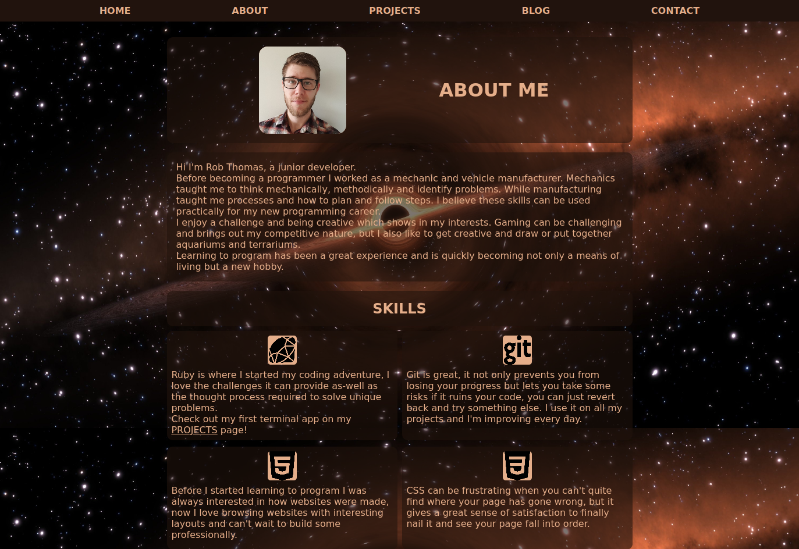
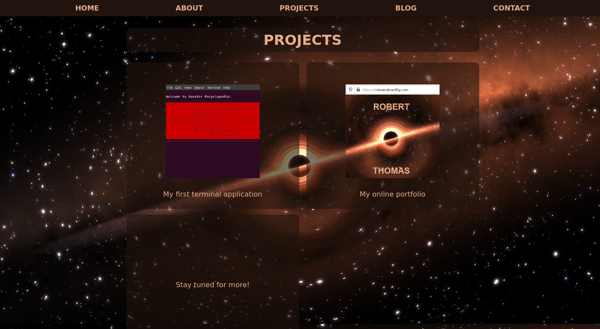
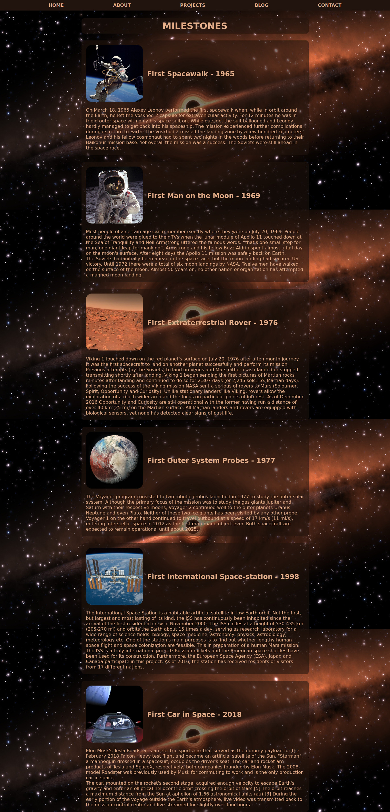
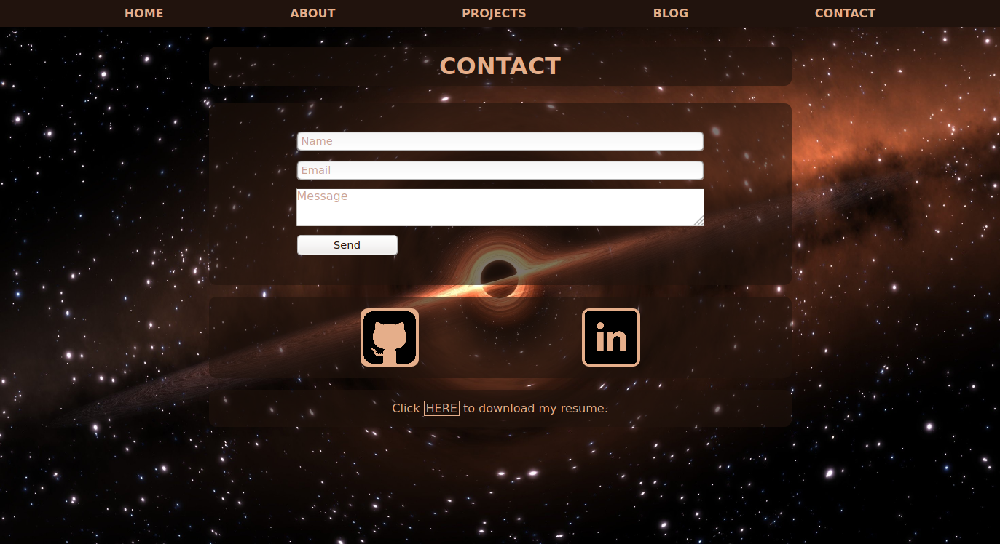
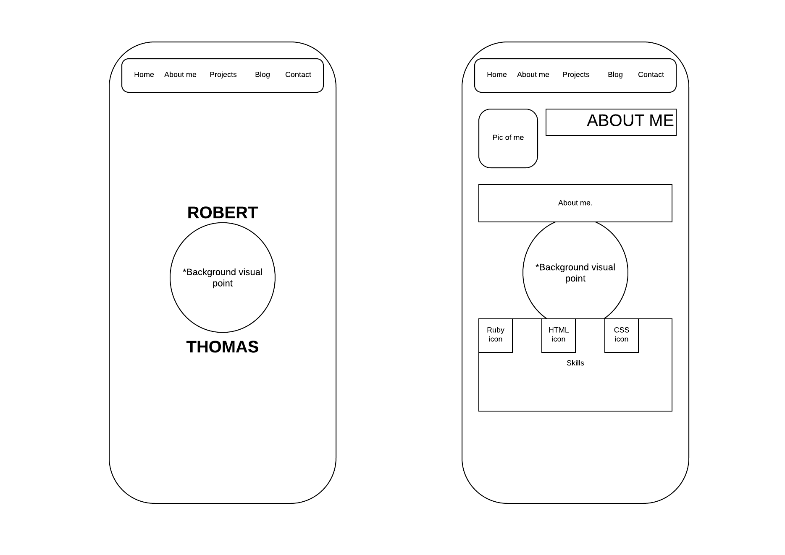
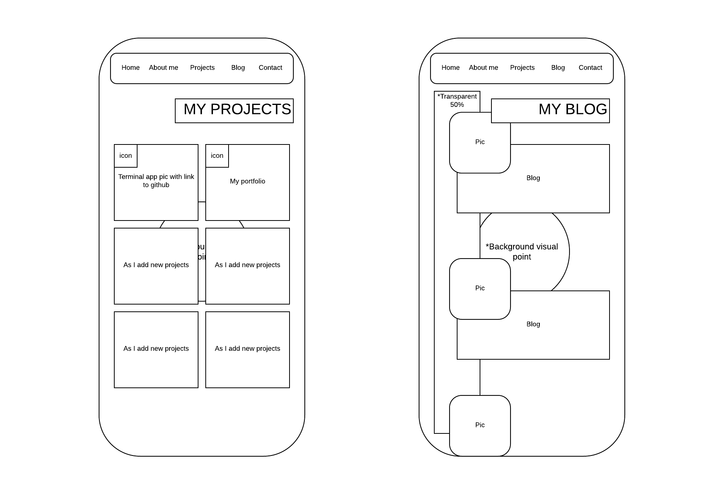
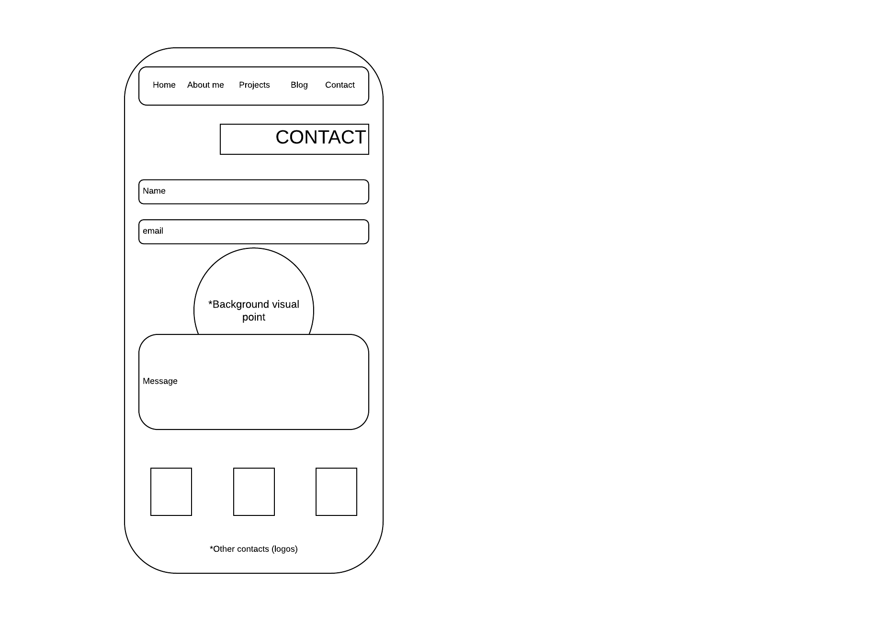
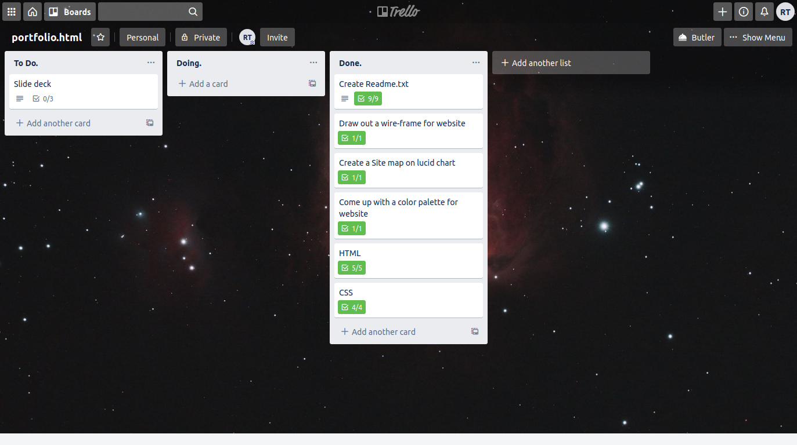

# Rob Thomas Portfolio Website

Website: https://robnarok.netlify.com/

Github: https://github.com/RobThomas30/html-portfolio

# Purpose

The purpose of this portfolio website is to showcase my html/css skills and introduce myself to potential employers or collaborators, while also creating a platform to upload projects and future projects to.

# Functionality and features

### Component 1: Navbar

The website will include a navigation bar that will be locked to the top of the screen which will allow users to easily navigate the website even if they have scrolled on the page, locking the navbar in place reduces unnecessary scrolling and increases the speed in which the website can be browsed.
It will also showcase a hover function to increase engagement, when a page link is hovered over a square will surround your selection.

### Component 2: Projects

The website will be used to showcase my projects in my professional career, The project section has been setup in a grid format that not only displays all projects but can easily have new projects added as they are completed.

### Component 3: Viewability

The website has been designed using view-heights/widths and percentages primarily this allows the website to be viewed on any browser or device scaling and displaying the information neatly and precisely.

### Component 4: Contact

It is easy to contact me directly by email using the form on the contact page.
Icons will also be displayed for other means of contact e.g github or linkedIn, and finally a downloadable resume will be available here.

### Consistent style:

A single background image was chosen for the website it has an interesting visual point that draws the users eye to the center of the screen.
My colour pallette has been derived from the image and is consistent over all pages on the site.	

### Subresource integrity

Sub-resource integrity ensures that the files delivered to your web application do not have any unexpected content such as malicious code injected by a third party.
This has been achieved by creating a hash using sha584 and using this hash as the value of the integrity attribute of our link tag.

# Sitemap

The website simply has all pages link to each other via the navigation bar. A sitemap for the website is presented below.

# Screenshots

##### Home page

##### Projects page

##### CV page

##### CV page

# Target Audience

1. Myself
2. Employers
3. Collaborators

I included myself in target audience because I wish to constantly update the website, add new features as I learn, update it's appearance and upload new projects.
Seeing as this website showcases my work and abilities the other target audience would be potential employers or those who may wish to collaborate with me. 

# Tech stack

- HTML is used for the content of all webpages
- CSS is used for the styling and positioning of elements.
- Netlify is used for web-hosting.

# Wire-frames

Mobile devices are the future I designed my website for mobile first and then added a couple of restrictions with css to make it view nicely on a monitor.

##### Home & About Wire-frame

##### Projects & Blog Wire-frame

##### Contact Wireframe

# Project Management

Trello was used as a project management tool to set out objectives and a structure to follow

##### Trello Screenshot

